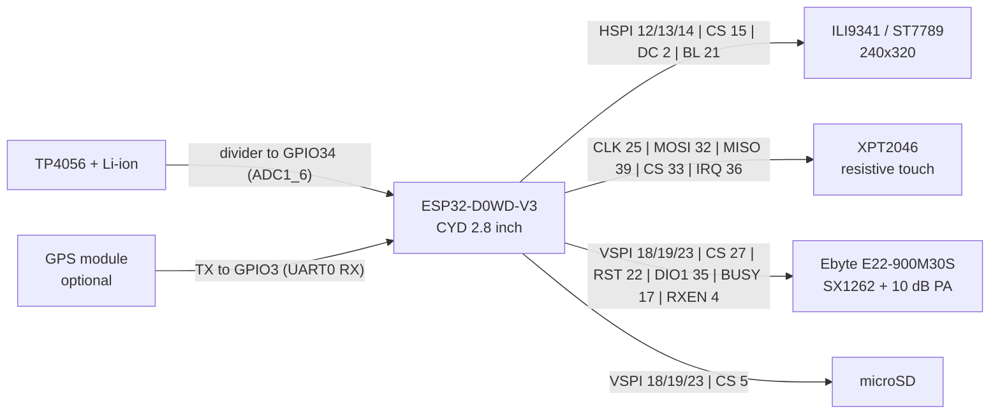

# lcdwiki_2_8_e22

Meshtastic for a hand-wired LCDWIKI / QDTech 2.8" ESP32-32E (CYD family,
ESP32-2432S028R pinout) with an **Ebyte E22-900M30S** LoRa module.

`variant.h` is the source of truth and documents the reasoning behind every pin
choice. This file is the summary.

| | |
|---|---|
| MCU | ESP32-D0WD-V3, 4 MB flash, **no PSRAM**, 320 KB RAM |
| Display | ILI9341 **or** ST7789, 240×320, portrait by default |
| Touch | XPT2046, resistive, on **dedicated pins** (not the LCD bus) |
| Radio | Ebyte E22-900M30S — SX1262 behind a 10 dB PA, 30 dBm rated, TCXO |
| Storage | microSD on the LoRa bus, CS 5 |
| Power | TP4056 charger, battery sensed on GPIO34 |

## Two build environments

The same board ships with either panel controller under one product name, and
the panel cannot be probed for, so it is a build-time choice:

| Environment | Panel |
|---|---|
| `lcdwiki_2_8_e22` | ILI9341 |
| `lcdwiki_2_8_e22_st7789` | ST7789 |

Flashing the wrong one gives a garbled, mirrored or blank screen. That is the
most common mix-up on these boards; try the other environment before suspecting
the hardware.

## Wiring



**Display — HSPI, on-board**

```
MISO 12   MOSI 13   SCLK 14   CS 15   DC 2   BL 21 (PWM)
RST -> not wired; panel reset is tied to EN
```

**Touch — XPT2046, its own pins, on-board**

```
CLK 25   MOSI 32   MISO 39   CS 33   IRQ 36
```

Touch shares nothing with the LCD. This is why `LORA_RESET` and `LORA_DIO1` had
to move off 25 and 39 — those belong to touch.

**LoRa — E22-900M30S, VSPI (the wires you add)**

| E22 | GPIO | Note |
|---|---|---|
| SCK | 18 | shared with microSD |
| MISO | 19 | shared |
| MOSI | 23 | shared |
| NSS | 27 | |
| NRST | 22 | |
| DIO1 | 35 | |
| BUSY | **17** | RGB LED blue channel |
| RXEN | 4 | RGB LED red channel |
| TXEN | — | wire to the module's own **DIO2** pad, not to a GPIO |
| DIO3 | — | TCXO reference, driven by the SX1262 |

Three of those placements are load-bearing:

- **BUSY must not go back to GPIO34.** On the QDTech board that pin carries the
  TP4056 battery divider. With BUSY there, RadioLib stalls ~20 s waiting for
  BUSY to fall, `begin()` returns `-2` (`CHIP_NOT_FOUND`) and the node records
  critical error 3 (`NO_RADIO`).
- **RXEN must not go on GPIO26.** It sits next to TOUCH_CLK (25) and RadioLib
  holds RXEN asserted throughout receive, which kills the touchscreen outright.
- **TXEN goes to DIO2, never a GPIO.** DIO2 is output-only. Leaving RXEN
  unconnected instead breaks receive while transmit still appears to work.

**microSD** — CS 5, sharing VSPI 18/19/23 with the radio. Any read must hold
`spiLock` or it corrupts a LoRa transaction in flight.

**GPS (optional)** — TX to GPIO3, which is UART0 RX. See the caveat below.

## Build and flash

```bash
pio run -e lcdwiki_2_8_e22_st7789        # or -e lcdwiki_2_8_e22 for ILI9341
```

The build produces a single merged image. Write it at `0x0`:

```bash
esptool --chip esp32 --port COM3 --baud 460800 write-flash \
  --flash-mode dio --flash-freq 40m --flash-size 4MB \
  0x0 .pio/build/<env>/firmware-<env>-<version>.factory.bin
```

Use the `.factory.bin`, not `firmware.bin`. The factory image carries the
bootloader and the partition table; writing the bare app to `0x10000` over a
foreign partition table leaves the node in a boot loop.

To wipe stored config as well (region, channels, node identity), erase first:

```bash
esptool --chip esp32 --port COM3 erase-flash
```

## Maps

The firmware ships **without** map data. Build your own:

```bash
python tools/make_map.py "Edgewood, MD"
python tools/make_map.py "Boulder, Colorado" --km 30 --no-local
python tools/make_map.py --lat 39.4187 --lon -76.2944 --km 24 --copy-to E:\
```

It geocodes the place, downloads from OpenStreetMap and writes `basemap.bin`.
Copy that to the **root of the microSD card**. `--no-local` drops residential
streets for a much smaller file; `--km` sets the area.

The map frame sits immediately right of Home (compass icon). It plots heard
nodes north-up around your position over roads and water, names the streets, and
shows the nearest node's distance and SNR. Swipe up/down to zoom; tap and
left/right still move between frames.

Supporting tools:

| Tool | Purpose |
|---|---|
| `tools/make_map.py` | place name in, `basemap.bin` out |
| `tools/prepare_basemap.py` | the packer, if you want the raw knobs |
| `tools/preview_basemap.py` | decodes a `.bin` back to SVG — the reference decoder |
| `tools/mock_map_labels.py` | renders frames at device fidelity, for tuning labels without flashing |

Limits worth knowing:

- Positions are int16 metres from the box centre, so a box cannot exceed ~64 km.
- Street names are addressed by a uint16 offset, so a very large area can
  overflow the name table; `--no-local` fixes it.
- Labels are horizontal only. `OLEDDisplay` cannot rotate text, so a name sits
  near its road rather than along it.

## Maps and Bluetooth are mutually exclusive

The microSD card is mounted **only while Bluetooth is off**. Toggle it at
Menu → Bluetooth; the node reboots either way, because the card can only be
mounted during `setup()`. With Bluetooth on, the map frame says so on screen.

This is not a preference, it is the memory budget. Measured on this board, in
8-bit-capable DRAM:

```
pool at start of setup()              124,608 bytes
mounting the SD card                  -30,408
Meshtastic core, UI, radio, modules   -71,172
left when NimBLE initialises            23,028   <- not enough
```

NimBLE then fails to allocate a mutex and aborts in `lock_init_generic`, which
presents as a boot loop the moment Bluetooth is switched on. Note that the
"Free heap" log reads ~64 KB at that point and is misleading: about 41 KB of it
is IRAM handed to the heap, which can never satisfy a byte-addressable
allocation. Set `SDCARD_EXCLUSIVE_WITH_BLUETOOTH` in `variant.h` to opt in;
boards with PSRAM run both and should not define it.

## What is left out, and why

4 MB of flash and 320 KB of RAM with no PSRAM. These are set in
`platformio.ini`:

| Flag | Removes |
|---|---|
| `MESHTASTIC_EXCLUDE_MQTT` | MQTT uplink/downlink |
| `MESHTASTIC_EXCLUDE_STOREFORWARD` | store-and-forward server/client |
| `MESHTASTIC_EXCLUDE_ENVIRONMENTAL_SENSOR` | environment telemetry |
| `MESHTASTIC_EXCLUDE_ENVIRONMENTAL_SENSOR_EXTERNAL` | external environment sensors |
| `MESHTASTIC_EXCLUDE_AIR_QUALITY_SENSOR` | air-quality telemetry |
| `MESHTASTIC_EXCLUDE_HEALTH_TELEMETRY` | health telemetry |
| `MESHTASTIC_EXCLUDE_POWER_TELEMETRY` | power telemetry |
| `MESHTASTIC_EXCLUDE_TELEMETRYDB` | on-device telemetry history |
| `MESHTASTIC_EXCLUDE_DETECTIONSENSOR` | detection-sensor module |
| `MESHTASTIC_EXCLUDE_FILES_MANIFEST` | file browsing from the phone app |

`MESHTASTIC_EXCLUDE_FILES_MANIFEST` is not about size. The phone's config
handshake walks the filesystem three levels deep collecting up to 64 entries,
allocating a `shared_ptr` per entry; with ~96 KB free that runs out mid-walk and
aborts in `lock_init_generic`, so the node rebooted every time a phone
connected. Excluding it sends an empty manifest instead.

**Do not add `MESHTASTIC_EXCLUDE_ADMIN`.** `AdminModule` is the only handler for
`ADMIN_APP` packets, which is how both the phone app and the CLI write *every*
config change, including purely local ones. Excluded, the node silently drops
them: no error, no log, the app just redisplays the old value.

Also note these exclusion names do nothing — they are not real flags:
`MESHTASTIC_EXCLUDE_TELEMETRY`, `_ANALOGIN`, `_STORE_FORWARD`,
`_ADMIN_CHANNELS`.

## Gotchas

- **The GPS only works with USB unplugged.** It sits on GPIO3, which is UART0
  RX, and the CH340 drives that pin whenever USB is attached. The two contend,
  so the receiver reads nothing over USB. Debug over Bluetooth instead. The
  `meshtastic --port` serial CLI is unavailable for the same reason.
- **Transmit power.** `EBYTE_E22_900M30S` makes Meshtastic subtract the PA's
  10 dB before driving the chip. Without it the SX1262 runs at a full 22 dBm and
  the PA adds 10 dB on top, radiating ~32 dBm while the node reports 22.
- **Battery multiplier is provisional.** `ADC_MULTIPLIER 2.0` assumes a 1:1
  divider on GPIO34. It reads plausibly (3,525 mV at 29%) but has not been
  checked against a meter. With no USB-detect pin, Meshtastic infers USB power
  purely from voltage above 4,200 mV, so a part-charged cell reads as "on
  battery" while plugged in. If a reading lands between 2,600 and 3,100 mV the
  node deep-sleeps after 11 consecutive samples. Correct it live from the app
  via `adc_multiplier_override`, no reflash needed.
- **Touch calibration is orientation-specific** and stored in NVS. Flipping
  between portrait and landscape triggers a fresh 4-point calibration.

## Status

Verified on hardware (ST7789 build): display, touch, radio init, SD card,
offline map with street names, battery sense, Bluetooth/SD gate.

The **ILI9341 environment compiles but has not been run** with the map, SD gate
or BUSY-17 changes.
